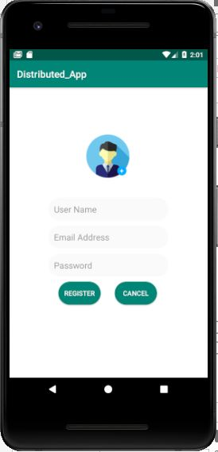
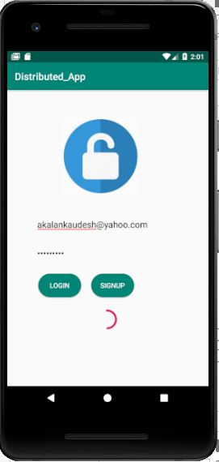
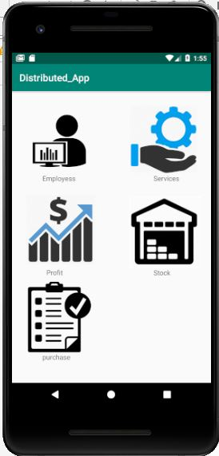
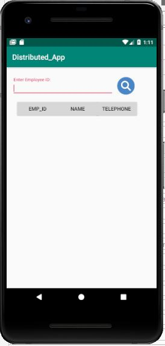
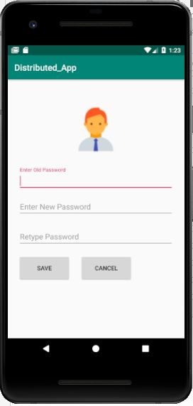
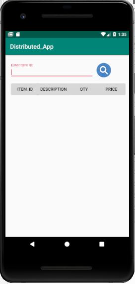
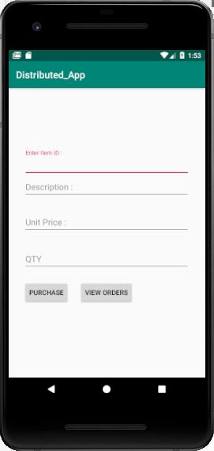

# Distributed-system-Mobile-App

For a large-scale super market, it is very difficult to maintain the daily business processes. Because if we take like Cargill’s food city, their business process is very complex and  difficult to maintain manually. Therefore we implemented stock and sales management system. By using this system, we can manage the daily point of sales, stock management, profit calculation ,etc. And also it will suitable for large scale grocery store or an super market. User friendly interface every one can easily understand the system working process. This mobile application is an one part of the distributed system.     

## Sign-up

This page was facilitate managers to sign up for their new manager accounts. They can create user accounts with their own images. And do the registration for the mobile application.

 

## 	Login

This is the main login page for the mobile application. This was connected with the google firebase. It will authenticate the login user credentials.

 

## Main page.

This is the main page for mobile application. This will navigate the user to search employees, services, profit, stock and purchases.

 

## Customer page

This page can use to search for the employee details.

 

## Services Page 

In the service page can change the manager login credentials.

 

## Stock Page

In the stock page user can view the fully details of the current stock. 

 

## Purchase Page

Purchase page will provide the purchasing for the stock. Manager can make billing for the new purchase using the mobile application. And also it has included the view purchases page. 

 